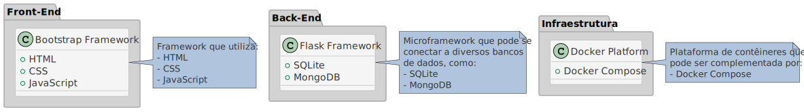

# Instruções para os Laboratórios da Disciplina de IHC (Interação Humano-Computador)

Prezado(a), aluno(a), 

Seja bem-vindo(a) aos laboratórios da disciplina de IHC (Interação Humano-Computador). Ao longo da disciplina veremos os fundamentos do _Design_ de Produto, UX - _User eXperience_ (Experiência do Usuário), UI - _User Interface_ (Interface do Usuário) e discutiremos ferramentas e técnicas essenciais para promover um desenvolvimento ágil de soluções em IHC. 

Estabelecida essa base, daremos ênfase às tecnologias de front-end, como HTML, CSS, JavaScript e Bootstrap, e ao protocolo HTTP (_Hypertext Transfer Protocol_), com a introdução à arquitetura de microsserviços e ao microframework Python Flask. Posteriormente, utilizaremos bancos de dados, relacionais ou não relacionais, para demonstrar a construção de aplicações web dinâmicas. 

Este repositório foi projetado para auxiliá-lo a configurar e gerenciar essas ferramentas. Siga atentamente as instruções abaixo para configurar seu ambiente. 

### Configuração do Ambiente: 

Para as atividades práticas, é essencial ter um ambiente de desenvolvimento bem configurado. Com o objetivo de uniformizar essa experiência, disponibilizamos uma máquina virtual (_Virtual Machine_ - VM) pré-configurada, contendo todas as ferramentas e dependências necessárias. Essa abordagem visa assegurar que os todos os alunos possuam um ambiente padronizado e consistente, reduzindo complicações em função de eventuais diferenças entre os tipos de hardware e versões de software. Embora o Docker possa rodar diretamente em diversos sistemas operacionais, adotar esta estratégia simplifica o processo de suporte em caso de dúvidas, além de proporcionar soluções mais ágeis no caso de desafios técnicos. 

- **Nota**: O uso da VM busca uniformizar o funcionamento dos ambientes e facilitar o suporte. No entanto, valorizamos a autonomia de cada estudante, especialmente para a prática em seu computador pessoal. Se você já está familiarizado com Docker e deseja rodá-lo no seu sistema operacional nativo, este repositório está preparado para isso. Usuários de hardwares recentes da Apple, como o M2, devem considerar essa opção, devido a potenciais incompatibilidades com algumas versões do VirtualBox, originalmente desenvolvidas para processadores padrão x86_64. Para aqueles que utilizam Windows e preferem evitar VMs, especialmente quando seu dispositivo possui menos que 6GB de RAM, o _Windows Subsystem for Linux_ (WSL) é uma opção interessante. No entanto, lembre-se de que o WSL, apesar de eficiente, não oferece um ambiente Linux plenamente integrado e apresenta nuances entre suas versões (WSL e WSL 2). 

## 1. Sobre a Imagem OVA

OVA (_Open Virtual Appliance_) é um formato de arquivo para máquinas virtuais (VMs), contendo toda a configuração e discos virtuais necessários. Ele simplifica a portabilidade e implantação de ambientes virtualizados, permitindo importações fáceis em plataformas como o Oracle VirtualBox e outros softwares de virtualização. 

Oracle VirtualBox é um software de virtualização de código aberto, que permite executar vários sistemas operacionais em uma única máquina física. Com ele, é possível criar e gerenciar máquinas virtuais, cada uma com seu sistema operacional, aplicativos e arquivos em um ambiente isolado. Ele é compatível com diversos sistemas, como Windows, Linux e MacOS.

Assim, utilizando um arquivo OVA, é possível distribuir imagens pré-configuradas de software, assegurando que os laboratórios possam ser reproduzidos em um ambiente consistente, independentemente da localização de execução. A imagem OVA fornecida já vem equipada com ferramentas como `docker`, `docker-compose`, `git` e `ssh`, otimizando a configuração do laboratório.

Além disso, a imagem OVA padronizada otimiza a integração, potencializando a infraestrutura do laboratório para uso distribuído dos recursos. Por exemplo, uma estação pode ficar responsável pelo banco de dados e outra pela parte de _front-end_. 

### Como Usar:
1. Baixe a imagem OVA através deste [link](https://1drv.ms/f/s!As9_hcVH7a82gpovWfhahtGkRSmriA?e=vFJ2u3).
2. Caso não esteja instalado, baixe o Oracle VirtualBox através deste [link](https://www.oracle.com/br/virtualization/technologies/vm/downloads/virtualbox-downloads.html). 
3. Escolha a versão correspondente ao seu sistema operacional e siga as instruções de instalação.
4. Execute o Oracle Virtual Box e clique em **Arquivo** > **Importar Appliance**.
5. Selecione o arquivo OVA baixado e siga as instruções na tela.
6. Após a importação, dimensione os recursos de memória compatíveis com o laboratório ou computador pessoal. A imagem vem pré-configurada com 512MB de Memória RAM, o que é inicialmente suficiente para nossos laboratórios. 
7. Em configurações da VM, altere a porta USB para suporte à versão 1.1 ao invés da 2.0 e configure a placa de rede em modo [NAT](https://www.simplified.guide/virtualbox/port-forwarding#:~:text=Right%20click%20on%20the%20virtual%20machine%20and%20click,of%20the%20window.%20Click%20on%20Port%20Forwarding%20button), conforme as configurações de endereço IP e Porta de publicação das suas aplicações. 
8. Inicie a máquina virtual (VM). 

### Credenciais para acesso à VM:

- **Usuário:** labihc
- **Senha:** L@b1hc

## 2. Entendendo o modo NAT no VirtualBox

NAT (_Network Address Translation_) é a implementação do recurso de tradução de endereços de rede. No contexto do VirtualBox, ao configurar uma VM para usar NAT, você está permitindo que essa VM se comunique com redes externas, incluindo a Internet, usando o IP do host. Assim, a máquina _host_ (seu _desktop_ de laboratório ou _notebook_ pessoal) age como um _gateway_ e a VM parece estar atrás de uma rede privada.

Além de fornecer acesso à Internet, o recurso de NAT do VirtualBox também permite o redirecionamento de portas. Isso significa que você pode encaminhar o tráfego de uma porta específica no host para uma porta na VM. Isso é especialmente útil quando você deseja acessar serviços hospedados na VM, como as aplicações web e interfaces de gerenciamento, que poderão ser alcançadas diretamente do host ou mesmo a partir de outras máquinas na mesma rede. 

### Como configurar o Redirecionamento de Portas no VirtualBox:

1. **Inicie o VirtualBox** e selecione a máquina virtual que você deseja configurar.
2. Clique em **Configurações** (ou Settings).
3. Na janela de configurações, vá para **Rede**.
4. Sob a aba **Adaptador 1** (assumindo que está usando o adaptador padrão), certifique-se de que está configurado para **Conectado a: NAT**.
5. Clique em **Avançado** para expandir as opções.
6. Clique em **Redirecionamento de Portas**.
7. Na janela de redirecionamento de portas, você pode adicionar regras para encaminhar portas da sua máquina host para a sua máquina virtual.

### Exemplo de Tabela de Configuração de Portas:

| Nome da Regra | Protocolo | Endereço IP do Host | Porta do Host | Endereço IP da VM | Porta da VM |
|---------------|-----------|---------------------|---------------|-------------------|-------------|
| Acesso SSH    | TCP       | 127.0.0.1           | 2222          | 10.0.2.15         | 22          |
| FlaskApp 1    | TCP       | 127.0.0.1           | 8500          | 10.0.2.15         | 5000        |
| FlaskApp 2    | TCP       | 127.0.0.1           | 8501          | 10.0.2.15         | 5001        |
| FlaskApp 3    | TCP       | 127.0.0.1           | 8502          | 10.0.2.15         | 5002        |

- **Nota**: Ao configurar o redirecionamento de portas, evite as portas 0-1023, pois são reservadas. A porta 2222 é comumente usada para SSH devido à sua semelhança com a porta padrão 22 e por estar acima da faixa de portas reservadas, reduzindo a possibilidade de conflitos. Uma boa prática para servidores de aplicação é começar com a porta 8500. Sempre certifique-se de que a porta escolhida não esteja em uso. Ferramentas nativas do sistema operacional, como `netstat`, podem ajudar na verificação. 

## 3. Descrição das Ferramentas Utilizadas

Em aplicações web modernas, é comum dividirmos a arquitetura em três camadas principais: _Front-End_, _Back-End_ e Infraestrutura. O _Front-End_ refere-se à interface com a qual o usuário interage diretamente e compreende tudo o que é visível em uma interface, a exemplo do navegador web do desktop ou celular. Já o _Back-End_ é responsável pela lógica, processamento de dados e comunicação com bancos de dados, atuando como a "cozinha" de uma aplicação, onde todos os processos críticos ocorrem. Por fim, a Infraestrutura é a base sobre a qual toda a aplicação é construída e operada, envolvendo soluções de hospedagem, contêineres e outras ferramentas visando a disponibilidade, escalabilidade e segurança da aplicação. Juntas, essas camadas proporcionam uma experiência fluida e coesa para o usuário final e facilitam a construção e manutenção para os engenheiros de software, plataforma e desenvolvedores: 



### Front-End:

- **HTML**: HTML (_HyperText Markup Language_) é a linguagem padrão para criar páginas e aplicações web, sendo fundamental para definir a estrutura de uma página web, como cabeçalhos, parágrafos, links, imagens e outros elementos.

- **CSS**: CSS (_Cascading Style Sheets_) é uma linguagem usada para estilizar documentos escritos em HTML. Ela define como os elementos da página devem ser customizados e exibidos. CSS é essencial para personalizar a aparência de um _site_, pois permite que os desenvolvedores apliquem estilos, animações e _layouts_ consistentes em diferentes dispositivos e tamanhos de tela.

- **JavaScript**: Originalmente desenvolvimento pela Netscape, é uma linguagem de programação de alto nível, interpretada e orientada a objetos, amplamente utilizada para adicionar interatividade a páginas web, permitindo comportamentos dinâmicos e operações assíncronas. Com o JavaScript, os desenvolvedores podem criar aplicações web mais atraentes, contendo carrosséis de imagens, formulários interativos, gráficos animados e até mesmo jogos. 

- **Bootstrap**: É um _framework_ front-end gratuito e de código aberto, utilizado para desenvolvimento web e responsivo. Criado pelo Twitter (X.com), fornece uma variedade de componentes HTML, CSS e JavaScript projetados para facilitar o desenvolvimento de aplicações web que se adaptam automaticamente a diferentes tamanhos de tela, desde dispositivos móveis a desktops. É uma escolha popular entre os desenvolvedores, pois fornece uma base sólida para criar sites responsivos rapidamente. Com sua ampla gama de componentes prontos para uso, podemos acelerar o processo de desenvolvimento e manter a consistência do _design_. 

### Back-End:

- **Flask**: É um microframework web escrito em Python, flexível e extensível, sendo ideal para iniciar o desenvolvimento de aplicações web, APIs e até mesmo sistemas mais complexos. Ele é classificado como microframework porque não exige determinadas ferramentas ou bibliotecas e por isso é frequentemente escolhido para projetos que necessitam de uma solução mais enxuta e rápida para colocar uma aplicação web ou API (_Application Programming Interface_) Python em funcionamento. Sua natureza minimalista permite que os desenvolvedores possam adicionar apenas as extensões que precisam, sem a sobrecarga pré-existente de um _framework_ mais pesado. 

- **SQLite**: É um sistema de gerenciamento de banco de dados (SGDB) relacional leve, que não adota o modelo cliente-servidor. Ao invés disso, todo o banco de dados é armazenado em um único arquivo, tornando-o altamente portátil e eficiente para aplicações que requerem um armazenamento estruturado e ágil. É ideal para prototipação rápida de aplicações web e projetos de soluções que não necessitam de um banco de dados de grande escala. 

- **MongoDB**: É um banco de dados NoSQL (Not-only SQL)orientado a documentos. Ao contrário dos SGBDs relacionais, que tradicionalmente usam tabelas, colunas e registros que dependem de relacionamentos estritos, o MongoDB opera com uma arquitetura baseada em coleções e documentos. Sua natureza de esquema dinâmico permite o armazenamento de dados semi-estruturados, proporcionando alta escalabilidade e flexibilidade para o desenvolvimento de aplicações modernas.

### Infraestrutura:

- **Docker**: No desenvolvimento web, gerenciar serviços integrados pode ser desafiador. Docker simplifica essa tarefa, permitindo que aplicações sejam encapsuladas em contêineres. Essas unidades contêm o código e suas dependências, assegurando operação consistente em diferentes ambientes. Imagine contêineres como pacotes isolados com tudo necessário para sua aplicação funcionar, prontos para operar onde o Docker estiver disponível. Esses contêineres são leves, rápidos de iniciar e facilmente transferidos entre seu computador e plataformas em nuvem.

- **Docker Compose**: O Docker Compose, parte do ecossistema Docker, facilita a gestão de aplicações multicontêiner através de um arquivo `docker-compose.yml`. Com o comando `docker-compose up -d`, todos os contêineres no arquivo são ativados juntos, assegurando sua correta configuração e integração. Por exemplo, ao invés de configurar manualmente contêineres para um servidor web, MongoDB e Redis, o Docker Compose permite fazer isso centralizadamente em um arquivo. Com isso, eliminamos a complexidade das instalações manuais, aumentando a conveniência e eficiência. 

## 4. Preparando o Ambiente de Laboratório

Depois de acessar o ambiente virtual:

1. Baixe os arquivos do projeto:

```bash   
   sudo su -
   cd /opt
   git clone https://github.com/klaytoncastro/ihceub
```

2. Construa e inicie os serviços usando o Docker Compose. 

```bash
   cd /opt/ihceub/<diretorio_da_aplicacao>
   docker-compose build
   docker-compose up -d
```

3. Para criar e alterar os arquivos de configuração diretamente na VM, pode ser utilizado o editor VIM, opção bastante robusta e versátil para terminais Linux:

### Usando o Vim: Guia Básico

O Vim é mais do que um simples editor de texto, é uma ferramenta poderosa e muitos consideram-no um editor indispensável, especialmente administradores de sistemas e desenvolvedores, permitindo que usuários mais experientes editem arquivos complexos com poucos comandos. Neste guia, focaremos apenas nas operações básicas: abrir, editar e salvar arquivos. Lembre-se de que o Vim é uma ferramenta profunda e poderosa, e há muito a aprender além destes comandos básicos: 

1. **Abrir um arquivo**
    ```bash
    vim <nome_do_arquivo.py>
    ```

2. **Modo de Inserção**

    Após abrir ou criar um arquivo com o Vim, você estará no modo normal. Para inserir ou editar texto, você deve entrar no modo de inserção pressionando `Insert`.

3. **Salvar alterações**

    Para salvar as alterações feitas no arquivo, primeiro pressione `Esc` para retornar ao modo normal, depois digite `:w` e pressione `Enter`.

4. **Sair do Vim**

    - Sem salvar as alterações: Pressione `Esc` (para garantir que você está no modo normal), depois digite `:q!` e pressione `Enter`.
    - Após salvar as alterações: Digite `:wq` e pressione `Enter` ou apenas `:x`.

5. **Editar texto**

    No modo de inserção (após pressionar `i`), você pode editar o texto como em qualquer outro editor. Quando terminar, pressione `Esc` para voltar ao modo normal.

6. **Exibindo Números de Linha**

    Para exibir os números de linha no Vim, no modo normal, digite:
    
    ```bash
    :set number
    ```
    - Isso é útil porque facilita a navegação, a leitura e a referência a partes específicas do arquivo, especialmente em arquivos grandes ou quando se está fazendo depuração de código.

7. **Deletar uma Linha**

    No modo normal, posicione-se na linha que deseja deletar e digite `dd`.

### Dicas

- O Vim possui muitos comandos e atalhos que podem melhorar significativamente sua eficiência ao editar arquivos. Recomenda-se explorar mais o Vim conforme você se familiariza com os comandos básicos.
- Se você se encontrar em uma situação em que não sabe o que fazer, pressionar `Esc` várias vezes e então digitar `:q!` o levará de volta ao terminal, descartando todas as alterações.

- **Nota**: Para trabalhar com o código das suas aplicações e outras configurações necessárias em casa, recomenda-se instalar a IDE Visual Code Studio com o plugin SSH Remote ou uma ferramenta de transferência de arquivos com suporte a SFTP, como o Filezilla. Discutiremos a configuração desta abordagem complementar em sala de aula. 

### Usando o SSH para conexão: Guia Básico

SSH (_Secure Shell_) é um protocolo que possibilita a conexão e controle de servidores remotos, como a VM instanciada no Virtual Box. Para gerenciar nossa VM, recomendamos o uso de conexões SSH em vez da console física. O [Putty](https://www.putty.org/) é uma opção popular e confiável como cliente SSH, especialmente útil para sistemas Windows, embora esteja disponível para outras plataformas. Sua interface intuitiva e funcionalidades robustas o estabeleceram como preferência entre muitos administradores de sistemas e desenvolvedores ao longo dos anos. A versão _portable_ pode ser baixada e usada diretamente em nossos laboratórios. 

- **Nota**: Se você já possui outras ferramentas de SSH ou tem uma preferência particular, sinta-se à vontade para utilizá-las. 

1. Execute o PuTTY e no campo `Host Name (or IP address)`, digite: `127.0.0.1`. No campo `Port`, digite: `2222`. Isso é possível pois configuramos o redirecionamento de portas no VirtualBox para encaminhar a porta 2222 do host para a porta 22 da VM. 

2. Certifique-se de que a opção `Connection type` esteja definida como `SSH`. Clique no botão "Open" na parte inferior da janela. Uma janela de terminal será aberta. 

3. Na primeira vez que você se conectar, pode ser solicitado que confirme a chave SSH do servidor. Se isso acontecer, clique em `Yes` para aceitar a chave e continuar. 

4. Você será solicitado a fornecer um nome de usuário. Digite labihc e pressione `Enter`. Em seguida, será solicitada a senha. Digite `L@b1hc` e pressione `Enter`.

- **Nota**: Sempre que você reiniciar a VM ou mudar configurações de rede, pode ser que o endereço IP da VM mude. No entanto, com a configuração de redirecionamento de portas, você ainda pode se conectar usando 127.0.0.1 e a porta 2222, já que essa configuração é feita no host e não depende do IP da VM. 

5. Conveniência e Eficiência

- **Copiar e Colar**: Ao utilizar SSH, fica muito mais fácil copiar e colar comandos, scripts ou até mesmo arquivos entre o host e a VM. Essa funcionalidade torna a execução de tarefas mais rápida e evita erros humanos que podem ocorrer ao digitar manualmente.

- **Multitarefa**: Com o SSH, é possível estabelecer várias sessões em paralelo, permitindo que você execute várias tarefas simultaneamente. 

6. Evita as limitações da console "física"

- **Resolução e Interface**: A console física do Virtual Box pode apresentar limitações, como resolução de tela reduzida ou interações de interface de usuário não intuitivas. O SSH fornece uma interface padronizada, independentemente do software de virtualização usado.

- **Padrão de Gerenciamento**: Ao se familiarizar com o SSH, você estará equipando-se com uma habilidade crucial, não apenas para este ambiente de laboratório, mas para o desenvolvimento de soluções profissionais e situações futuras que envolvam a administração de sistemas, times de infraestrutura, DevOps, SRE e Cloud. 

### Docker & Docker Compose: Guia Básico

Docker e Docker Compose são ferramentas essenciais ao desenvolvedor moderno, facilitando a criação e acelerando a distribuição e execução de aplicações em ambientes consistentes, isolados e reproduzíveis. Através de contêineres, ele proporciona um modo eficaz de encapsular uma aplicação com todas as suas dependências, garantindo que ela funcione de maneira idêntica, independentemente de onde seja executada.

Por outro lado, o Docker Compose é uma ferramenta que facilita a definição e execução de aplicações multi-contêiner com o Docker. Com ele, é possível definir um conjunto de contêineres, suas configurações e dependências em um único arquivo e, em seguida, executar todo o conjunto com um único comando, sendo ideal para desenvolvimento local, teste e integração contínua.

Há uma extensa documentação disponível e uma comunidade bastante ativa. Recomenda-se a leitura da documentação oficial para se aprofundar se desejado, mas este guia básico é suficiente para iniciar a utilizar rapidamente as ferramentas. 

### Comandos do Docker:

1. **Baixar uma imagem do Docker Hub**
    ```bash
    docker pull <imagem>:<tag>
    ```

2. **Listar todas as imagens no seu sistema**
    ```bash
    docker images
    ```

3. **Rodar um contêiner a partir de uma imagem**
    ```bash
    docker run <opções> <imagem>
    ```

4. **Listar contêineres em execução**
    ```bash
    docker ps
    ```

5. **Listar todos os contêineres**
    ```bash
    docker ps -a
    ```

6. **Parar um contêiner**
    ```bash
    docker stop <contêiner_id_ou_nome>
    ```

7. **Visualizar logs de um contêiner**
    ```bash
    docker logs <contêiner_id_ou_nome>
    ```

8. **Remover um contêiner**
    ```bash
    docker rm <contêiner_id_ou_nome>
    ```

### Comandos do Docker Compose: 

1. **Iniciar serviços definidos no `docker-compose.yml` em modo interativo**
    ```bash
    docker-compose up
    ```

2. **Iniciar serviços definidos no `docker-compose.yml` em segundo plano**
    ```bash
    docker-compose up -d
    ```

3. **Parar serviços**
    ```bash
    docker-compose down
    ```

4. **Listar os serviços em execução**
    ```bash
    docker-compose ps
    ```

5. **Visualizar logs**
    ```bash
    docker-compose logs
    ```

### Limpeza de Imagens, Contêineres e Volumes

Na pasta `docker` deste repositório, você encontrará o script `docker-cleanup.sh` que faz a remoção de imagens antigas e desnecessárias. Isso pode ser útil para recuperar espaço no ambiente de desenvolvimento. 

1. Navegue até a pasta onde o script está localizado: 

```bash
cd caminho/para/pasta/docker
```

2. Para tornar o script executável, utilize o comando:

```bash
chmod +x docker-cleanup.sh
```

3. Execute o script:

```bash
./docker-cleanup.sh
```

- **Nota**: Este script remove recursos não utilizados e imagens antigas para recuperar espaço. Para evitar a remoção inadvertida de recursos importantes, certifique-se de entender o que ele faz antes de executá-lo. Lembre-se que, ao executá-lo, apenas os contêineres em execução serão mantidos no armazenamento da VM. 

### Pronto! 

Agora que você está com o ambiente preparado e pronto para começar os laboratórios. Em caso de dúvidas, não hesite em me contactar: [klayton.castro@ceub.edu.br](klayton.castro@ceub.edu.br). 